# 🚀 FusionMeet - LAN-Based All-in-One Collaboration Suite

<div align="center">


**A powerful, standalone multi-user communication platform designed exclusively for Local Area Networks**

[Features](#-core-features) • [Installation](#-installation--setup) • [Usage](#-usage-instructions) • [Architecture](#-system-architecture) • [Documentation](#-documentation)

</div>

---

## 📖 Overview

**FusionMeet** is a comprehensive LAN-based collaboration suite that brings enterprise-grade communication tools to your local network without requiring internet connectivity. Built entirely in Python using socket programming, it provides real-time video conferencing, crystal-clear audio, screen sharing, instant messaging, and seamless file sharing.


### ✨ Why FusionMeet?

✅ **100% LAN-Based** - No internet dependency, works entirely offline  
✅ **Complete Privacy** - Your data never leaves your local network  
✅ **Low Latency** - Optimized for real-time communication  
✅ **Easy Deployment** - Simple client-server architecture  
✅ **Feature-Rich** - All essential collaboration tools in one place  
✅ **Open Source** - Fully customizable and transparent  

---

## 🎯 Core Features

### 🎥 Multi-User Video Conferencing
- **Real-time video streaming** from all connected clients
- **Dynamic grid layout** displaying up to 9 participants (3×3)
- **JPEG compression** for efficient bandwidth utilization
- **Configurable quality** - 320×240 resolution at 30 FPS (adjustable in `config.py`)
- **Local preview** with selfie-mode mirroring
- **Thread-safe rendering** using PyQt5 signals/slots

### 🎤 Crystal-Clear Audio Conferencing
- **High-quality audio** - 22050 Hz, 16-bit, mono
- **N-1 Server-side mixing** - Prevents echo by mixing all audio except sender's
- **Real-time transmission** via UDP for minimal latency
- **Visual feedback** - Audio level indicators (planned)
- **Mute/unmute** controls with instant feedback

### 📺 Screen & Presentation Sharing
- **Full screen capture** using MSS library
- **Single presenter mode** - Server-enforced presenter lock
- **Optimized compression** - JPEG at 70% quality, 2 FPS
- **Low-latency delivery** - TCP for reliability
- **Automatic conflict prevention** - Only one presenter at a time
- **FPS counter** for performance monitoring

### 💬 Group Text Chat
- **Real-time messaging** via TCP for guaranteed delivery
- **Persistent chat history** throughout the session
- **Sender identification** - Clear username display
- **Timestamp support** for message tracking
- **Clean UI** - Integrated chat panel in main window

### 📁 File Sharing & Transfer
- **Secure file transfer** over TCP
- **Progress tracking** - Real-time upload/download indicators
- **Transfer speed monitoring** - MB/s display
- **Multi-file support** - Share multiple files simultaneously
- **Centralized storage** - Server manages shared files
- **File listing** - View all available files in session
- **Chunked transfer** - 32 KB chunks for reliable delivery
- **Size limit** - Up to 500 MB per file (configurable)

---

## 🏗️ System Architecture

### Detailed System Architecture Diagram

```mermaid
flowchart TB
    subgraph Clients["LAN Clients"]
        subgraph Client1["Client 1 (Alice)"]
            C1_CAM[📹 Webcam]
            C1_MIC[🎤 Microphone]
            C1_SCR[🖥️ Screen Share]
            C1_CHAT[💬 Chat]
            C1_FILE[📁 File Manager]
        end
        
        subgraph Client2["Client 2 (Bob)"]
            C2_CAM[📹 Webcam]
            C2_MIC[🎤 Microphone]
            C2_SCR[🖥️ Screen Share]
            C2_CHAT[💬 Chat]
            C2_FILE[📁 File Manager]
        end
        
        subgraph Client3["Client 3 (Charlie)"]
            C3_CAM[📹 Webcam]
            C3_MIC[🎤 Microphone]
            C3_SCR[🖥️ Screen Share]
            C3_CHAT[💬 Chat]
            C3_FILE[📁 File Manager]
        end
    end
    
    subgraph Server["Central Server (192.168.x.x)"]
        TCP[TCP Controller<br/>Port: 65435]
        UDP[UDP Media Router<br/>Port: 65436]
        MIXER[🎵 N-1 Audio Mixer]
        FILE_MGR[📂 File Storage]
        SESSION[👥 Session Manager]
    end
    
    %% UDP Connections (Video & Audio)
    C1_CAM -->|UDP:65436<br/>Video Stream| UDP
    C1_MIC -->|UDP:65436<br/>Audio Stream| UDP
    C2_CAM -->|UDP:65436<br/>Video Stream| UDP
    C2_MIC -->|UDP:65436<br/>Audio Stream| UDP
    C3_CAM -->|UDP:65436<br/>Video Stream| UDP
    C3_MIC -->|UDP:65436<br/>Audio Stream| UDP
    
    %% TCP Connections (Chat, Files, Screen)
    C1_CHAT -->|TCP:65435<br/>Messages| TCP
    C1_FILE -->|TCP:65435<br/>File Transfer| TCP
    C1_SCR -->|TCP:65435<br/>Screen Data| TCP
    C2_CHAT -->|TCP:65435<br/>Messages| TCP
    C2_FILE -->|TCP:65435<br/>File Transfer| TCP
    C2_SCR -->|TCP:65435<br/>Screen Data| TCP
    C3_CHAT -->|TCP:65435<br/>Messages| TCP
    C3_FILE -->|TCP:65435<br/>File Transfer| TCP
    C3_SCR -->|TCP:65435<br/>Screen Data| TCP
    
    %% Server Processing
    UDP --> MIXER
    TCP --> SESSION
    TCP --> FILE_MGR
    
    %% Broadcast Back to Clients
    MIXER -->|UDP:65436<br/>Mixed Audio| C1_MIC
    MIXER -->|UDP:65436<br/>Mixed Audio| C2_MIC
    MIXER -->|UDP:65436<br/>Mixed Audio| C3_MIC
    UDP -->|UDP:65436<br/>Video Broadcast| C1_CAM
    UDP -->|UDP:65436<br/>Video Broadcast| C2_CAM
    UDP -->|UDP:65436<br/>Video Broadcast| C3_CAM
    TCP -->|TCP:65435<br/>Chat Broadcast| C1_CHAT
    TCP -->|TCP:65435<br/>Chat Broadcast| C2_CHAT
    TCP -->|TCP:65435<br/>Chat Broadcast| C3_CHAT
    FILE_MGR -->|TCP:65435<br/>File Downloads| C1_FILE
    FILE_MGR -->|TCP:65435<br/>File Downloads| C2_FILE
    FILE_MGR -->|TCP:65435<br/>File Downloads| C3_FILE
    SESSION -->|TCP:65435<br/>Screen Broadcast| C1_SCR
    SESSION -->|TCP:65435<br/>Screen Broadcast| C2_SCR
    SESSION -->|TCP:65435<br/>Screen Broadcast| C3_SCR
    
    style Server fill:#e1f5ff,stroke:#0288d1,stroke-width:3px
    style Clients fill:#f3e5f5,stroke:#7b1fa2,stroke-width:2px
    style TCP fill:#ffebee,stroke:#c62828,stroke-width:2px
    style UDP fill:#e8f5e9,stroke:#2e7d32,stroke-width:2px
    style MIXER fill:#fff3e0,stroke:#ef6c00,stroke-width:2px
    style FILE_MGR fill:#fce4ec,stroke:#c2185b,stroke-width:2px
    style SESSION fill:#e0f2f1,stroke:#00695c,stroke-width:2px
```



### Detailed Architecture Diagram (ASCII)

```
┌─────────────────────────────────────────────────────────────────────┐
│                         LAN NETWORK (192.168.x.x)                   │
└─────────────────────────────────────────────────────────────────────┘
                                    │
        ┌───────────────────────────┼───────────────────────────┐
        │                           │                           │
┌───────▼────────┐          ┌───────▼────────┐          ┌──────▼─────────┐
│   CLIENT 1     │          │   CLIENT 2     │          │   CLIENT 3     │
│   (Alice)      │          │    (Bob)       │          │  (Charlie)     │
├────────────────┤          ├────────────────┤          ├────────────────┤
│ 📹 Webcam      │          │ 📹 Webcam      │          │ 📹 Webcam      │
│ 🎤 Microphone  │          │ 🎤 Microphone  │          │ 🎤 Microphone  │
│ 📺 Screen      │          │ 📺 Screen      │          │ 📺 Screen      │
│ 💬 Chat        │          │ 💬 Chat        │          │ 💬 Chat        │
│ 📁 Files       │          │ 📁 Files       │          │ 📁 Files       │
└────────┬───────┘          └────────┬───────┘          └────────┬───────┘
         │                           │                           │
         │ UDP:65436 (Video/Audio)   │                           │
         │ TCP:65435 (Chat/Files)    │                           │
         │                           │                           │
         └───────────────────────────┼───────────────────────────┘
                                     │
                          ┌──────────▼──────────┐
                          │   CENTRAL SERVER    │
                          │  (192.168.1.100)    │
                          ├─────────────────────┤
                          │  🔌 TCP: 65435      │
                          │  📡 UDP: 65436      │
                          ├─────────────────────┤
                          │  Components:        │
                          │  • Session Manager  │
                          │  • N-1 Audio Mixer  │
                          │  • Video Router     │
                          │  • Chat Broadcaster │
                          │  • File Manager     │
                          │  • Screen Router    │
                          └─────────────────────┘
                                     │
         ┌───────────────────────────┼───────────────────────────┐
         │                           │                           │
         ▼                           ▼                           ▼
   Broadcast to                Broadcast to                Broadcast to
   All Clients                All Clients                 All Clients
```

### Client-Server Model

**Server Responsibilities:**
- 🔌 Accepts TCP connections on port 65435
- 📡 Routes UDP media packets on port 65436
- 🎵 Performs N-1 audio mixing
- 📂 Manages file inventory and transfers
- 👥 Tracks active participants and sessions
- 🔄 Broadcasts messages and status updates

**Client Responsibilities:**
- 🖥️ PyQt5-based graphical user interface
- 📷 Captures audio, video, and screen content
- 🗜️ Compresses and encodes media streams
- 📤 Sends data to server via TCP/UDP
- 📥 Receives and decodes remote media
- 🎨 Renders video grid and UI components

### Communication Protocols

#### 🔴 TCP (Port 65435) - Reliable Channel
Used for control and data that must be delivered reliably:

| Data Type | Direction | Purpose |
|-----------|-----------|---------|
| **Authentication** | Client → Server | User login and session join |
| **Session Management** | Bidirectional | Session creation, participant tracking |
| **Chat Messages** | Client → Server → All Clients | Text messaging |
| **File Metadata** | Client → Server → All Clients | File info broadcast |
| **File Content** | Client ↔ Server ↔ Client | Chunked file transfer (32KB chunks) |
| **Control Commands** | Bidirectional | Video/audio status updates |
| **Screen Sharing** | Client → Server → All Clients | Screen frames (reliability over speed) |
| **Participant List** | Server → All Clients | Active users updates |

#### 🟢 UDP (Port 65436) - Real-Time Channel
Used for media streaming where speed is critical:

| Data Type | Direction | Characteristics |
|-----------|-----------|-----------------|
| **Video Frames** | Client → Server → All Clients | JPEG compressed (50%), 320×240 |
| **Audio Chunks** | Client → Server → Mixer → All Clients | 22050 Hz, 16-bit, mono, 2048 samples |
| **Low-latency Media** | Bidirectional | Best-effort delivery, tolerates packet loss |

**Protocol Selection Rationale:**
- **TCP for Chat/Files/Screen**: Ensures no data loss, maintains message order
- **UDP for Audio/Video**: Minimizes latency, occasional frame loss acceptable
- **Hybrid Approach**: Balances reliability and real-time performance

### Data Flow Diagrams

#### Video Streaming Flow (UDP)
```
┌─────────┐                                              ┌─────────┐
│ Client1 │                                              │ Client2 │
│  Alice  │                                              │   Bob   │
└────┬────┘                                              └────┬────┘
     │                                                        │
     │ 1. Capture frame (OpenCV)                             │
     │ 2. Resize to 320×240                                  │
     │ 3. JPEG compress (~50%)                               │
     │ 4. Pickle with metadata                               │
     │                                                        │
     │ {'type':'video',                                      │
     │  'username':'Alice',                                  │
     │  'frame':<JPEG bytes>,                                │
     │  'timestamp':xxx}                                     │
     │                                                        │
     ▼                  UDP:65436                            │
┌────────────────────────────────┐                          │
│         SERVER                 │                          │
│  Video Router                  │                          │
│                                │                          │
│  • Receives video packet       │                          │
│  • Identifies sender           │                          │
│  • Broadcasts to all OTHER     │                          │
│    clients (not sender)        │                          │
└────────────────────────────────┘                          │
                 │                                          │
                 │ Broadcast UDP:65436                      │
                 └──────────────────────────────────────────▼
                                                       ┌─────────┐
                                                       │ Client2 │
                                                       │   Bob   │
                                                       └─────────┘
                                                            │
                                                            │ 1. Receive packet
                                                            │ 2. Unpickle data
                                                            │ 3. cv2.imdecode JPEG
                                                            │ 4. Convert to QPixmap
                                                            │ 5. Display in grid
                                                            ▼
```

#### Audio Streaming Flow with N-1 Mixing (UDP)
```
Client A          Client B          Client C
   │                 │                 │
   │ Audio: A        │ Audio: B        │ Audio: C
   │ (PCM 2048)      │ (PCM 2048)      │ (PCM 2048)
   │                 │                 │
   ▼ UDP:65436       ▼ UDP:65436       ▼ UDP:65436
   └─────────────────┼─────────────────┘
                     │
              ┌──────▼──────┐
              │   SERVER    │
              │ Audio Mixer │
              └──────┬──────┘
                     │
        ┌────────────┼────────────┐
        │            │            │
        ▼            ▼            ▼
   Mix(B+C)      Mix(A+C)     Mix(A+B)
        │            │            │
        │ UDP:65436  │ UDP:65436  │ UDP:65436
        ▼            ▼            ▼
   Client A      Client B      Client C
        │            │            │
        ▼            ▼            ▼
    Play(B+C)    Play(A+C)    Play(A+B)

Each client hears everyone EXCEPT themselves (prevents echo)
```

#### Chat Message Flow (TCP)
```
┌─────────┐
│ Client1 │
│  Alice  │
└────┬────┘
     │
     │ 1. User types: "Hello everyone!"
     │ 2. Click Send button
     │
     │ TCP:65435
     │ Pickle({
     │   'type': 'chat',
     │   'username': 'Alice',
     │   'message': 'Hello everyone!',
     │   'timestamp': 1730678400.0
     │ })
     │
     ▼
┌────────────────────────┐
│       SERVER           │
│   Chat Broadcaster     │
│                        │
│ • Receives message     │
│ • Logs to session      │
│ • Broadcasts to ALL    │
│   clients in session   │
└────┬──────────┬────────┘
     │          │
     │ TCP:65435│ TCP:65435
     ▼          ▼
┌─────────┐  ┌─────────┐
│ Client2 │  │ Client3 │
│   Bob   │  │ Charlie │
└─────────┘  └─────────┘
     │            │
     │ Display:   │ Display:
     │ "Alice:    │ "Alice:
     │  Hello     │  Hello
     │  everyone!"│  everyone!"
     ▼            ▼
```

#### File Sharing Flow (TCP)
```
UPLOAD FLOW:
┌─────────┐
│ Client1 │ 1. Select file "report.pdf" (2.5 MB)
│  Alice  │ 2. Click "Share File"
└────┬────┘
     │ TCP:65435
     │ Send metadata:
     │ {'type':'file_metadata',
     │  'filename':'report.pdf',
     │  'size':2621440,
     │  'session':'Meeting1'}
     ▼
┌────────────────────────┐
│       SERVER           │
│   File Manager         │ 3. Receive metadata
│                        │ 4. Broadcast to all clients
│ uploads/Meeting1/      │ 5. Prepare to receive file
│   report.pdf           │
└────┬───────────────────┘
     │ 6. Open TCP connection for file transfer
     ▼
┌─────────┐
│ Client1 │ 7. Send file in 32KB chunks
│  Alice  │ 8. Show upload progress: 45% (1.12 MB / 2.5 MB)
└─────────┘ 9. Upload complete
     │
     │ 10. Server saves file
     ▼

DOWNLOAD FLOW:
┌─────────┐
│ Client2 │ 1. Sees "report.pdf" in Shared Files panel
│   Bob   │ 2. Clicks [Download]
└────┬────┘
     │ TCP:65435
     │ Request:
     │ {'type':'file_request',
     │  'filename':'report.pdf',
     │  'session':'Meeting1'}
     ▼
┌────────────────────────┐
│       SERVER           │ 3. Locate file
│   File Manager         │ 4. Open file for reading
│                        │ 5. Send in 32KB chunks
└────┬───────────────────┘
     │ TCP:65435
     │ Stream file chunks
     ▼
┌─────────┐
│ Client2 │ 6. Receive chunks
│   Bob   │ 7. Show download progress: 78% (1.95 MB / 2.5 MB)
└─────────┘ 8. Save to local disk
     │ 9. Download complete ✓
     ▼
```

#### Screen Sharing Flow (TCP)
```
┌─────────┐
│ Client1 │ 1. Click "Start Screen Share"
│  Alice  │ 2. Request presenter role
└────┬────┘
     │ TCP:65435
     │ {'type':'screen_share_request',
     │  'username':'Alice'}
     ▼
┌────────────────────────┐
│       SERVER           │ 3. Check if presenter exists
│  Session Manager       │ 4. If none, grant permission
│                        │ 5. Mark Alice as presenter
│  presenter: "Alice"    │ 6. Send confirmation
└────┬───────────────────┘
     │ TCP:65435
     │ {'type':'screen_share_granted'}
     ▼
┌─────────┐
│ Client1 │ 7. Start MSS screen capture
│  Alice  │ 8. Capture at 2 FPS
└────┬────┘ 9. Resize and JPEG compress (70%)
     │ 10. Send frames via TCP
     │
     │ TCP:65435 (every 500ms)
     │ {'type':'screen_frame',
     │  'username':'Alice',
     │  'frame':<JPEG bytes>}
     ▼
┌────────────────────────┐
│       SERVER           │ 11. Receive frame
│  Screen Router         │ 12. Broadcast to all OTHER clients
└────┬──────────┬────────┘
     │ TCP:65435│ TCP:65435
     ▼          ▼
┌─────────┐  ┌─────────┐
│ Client2 │  │ Client3 │ 13. Decode JPEG
│   Bob   │  │ Charlie │ 14. Display in screen panel
└─────────┘  └─────────┘ 15. Show "Alice is presenting"
```

### Threading Model

**Server Threads:**
1. Main thread - Accepts new TCP connections
2. Per-client TCP handler - One thread per connected client
3. UDP receiver - Single thread for all incoming media
4. Audio mixer - Processes and mixes audio streams

**Client Threads:**
1. Main thread - PyQt5 GUI event loop
2. TCP receiver - Processes control messages from server
3. UDP receiver - Handles incoming media packets
4. Video capture - QTimer-based frame capture (30 FPS)
5. Audio capture - Continuous recording loop
6. Screen capture - QTimer-based capture (2 FPS when active)

---

## 🛠️ Tech Stack & Libraries

### Core Technologies
- **Python 3.8+** - Primary programming language
- **Socket Programming** - TCP/UDP network communication
- **Multi-threading** - Concurrent operations
- **Pickle Protocol** - Data serialization

### Key Libraries

| Library | Version | Purpose |
|---------|---------|---------|
| **PyQt5** | Latest | GUI framework and user interface |
| **OpenCV (cv2)** | Latest | Video capture, processing, and encoding |
| **PyAudio** | Latest | Audio input/output and streaming |
| **NumPy** | Latest | Numerical operations and audio mixing |
| **MSS** | Latest | High-performance screen capture |
| **Pillow (PIL)** | Latest | Image processing and manipulation |

### Development Tools
- **PyInstaller** - Executable packaging
- **Git** - Version control

---

## 📦 Installation & Setup

### System Requirements

**Minimum:**
- OS: Windows 10/11, Linux (Ubuntu 18.04+), macOS 10.14+
- CPU: Intel Core i3 (2.0 GHz) or equivalent
- RAM: 4 GB
- Network: 100 Mbps LAN connection
- Python: 3.8 or higher

**Recommended:**
- CPU: Intel Core i5 (2.5 GHz+) or equivalent
- RAM: 8 GB
- Network: Gigabit (1000 Mbps) Ethernet
- Dedicated GPU for video processing

### Step 1: Clone the Repository

```bash
git clone https://github.com/gyanchandra2910/Fusion_meet.git
cd Fusion_meet
```

### Step 2: Create Virtual Environment

**Windows (PowerShell):**
```powershell
python -m venv .venv
.\.venv\Scripts\Activate.ps1
```

**macOS / Linux:**
```bash
python3 -m venv .venv
source .venv/bin/activate
```

### Step 3: Install Dependencies

```bash
pip install -r requirements.txt
```

**Or install manually:**
```bash
pip install PyQt5 opencv-python pyaudio numpy mss pillow
```

### Step 4: Install PyAudio (Windows - if needed)

If PyAudio installation fails on Windows:
```powershell
pip install pipwin
pipwin install pyaudio
```

---

## 🚀 Usage Instructions

### Starting the Server

1. **On the server machine**, navigate to the project directory:

```bash
cd Fusion_meet
```

2. **Activate the virtual environment:**

```powershell
.\.venv\Scripts\Activate.ps1  # Windows
source .venv/bin/activate      # macOS/Linux
```

3. **Run the server:**

```bash
python server.py
```

4. **Note the server IP address** displayed in the console (e.g., `192.168.1.100`)


### Starting the Client

1. **On each client machine**, navigate to the project directory:

```bash
cd Fusion_meet
```

2. **Activate the virtual environment:**

```powershell
.\.venv\Scripts\Activate.ps1  # Windows
source .venv/bin/activate      # macOS/Linux
```

3. **Run the client:**

```bash
python client.py
```

4. **Login Dialog:**
   - Enter **Server IP Address** (from Step 4 of server setup)
   - Enter **Your Name** (username)
   - Click **Connect**


### Main Interface Overview

```
┌──────────────────────────────────────────────────────────────┐
│  FusionMeet - Session: Team Meeting                         │
├─────────────────────────┬────────────────────────────────────┤
│                         │  👥 Participants (3)               │
│   VIDEO GRID (3×3)      │  • Alice (You) 🎥 🎤              │
│                         │  • Bob 🎥                          │
│  ┌───────┬───────┬───┐  │  • Charlie 🎥 🎤                   │
│  │ Alice │  Bob  │   │  ├────────────────────────────────────┤
│  │ (You) │       │   │  │  📁 Shared Files (2)               │
│  ├───────┼───────┼───┤  │  📄 Presentation.pdf (2.3 MB)      │
│  │Charlie│       │   │  │     [Download]                     │
│  │       │       │   │  │  📊 Report.xlsx (450 KB)           │
│  ├───────┼───────┼───┤  │     [Download]                     │
│  │       │       │   │  │  [+ Share New File]                │
│  └───────┴───────┴───┘  │                                    │
│                         │                                    │
├─────────────────────────┴────────────────────────────────────┤
│  💬 Chat                                                     │
│  Alice: Welcome to the meeting!                              │
│  Bob: Thanks! Can everyone hear me?                          │
│  Charlie: Yes, loud and clear.                               │
│  [Type your message here...]              [Send]             │
├──────────────────────────────────────────────────────────────┤
│  🎛️ Controls                                                 │
│  [🎥 Video] [🎤 Audio] [📺 Screen] [📁 Files] [🚪 Leave]    │
└──────────────────────────────────────────────────────────────┘
```


### File Sharing Workflow

1. **Upload a file:**
   - Click `📁 Files` or `[+ Share New File]`
   - Select file from file dialog
   - Monitor upload progress
   - File appears in "Shared Files" for all participants

2. **Download a file:**
   - Locate file in "Shared Files" panel
   - Click `[Download]` button
   - Choose save location
   - Monitor download progress

---

## 📂 Folder Structure

```
FusionMeet/
├── 📄 README.md                    # This file
├── 📄 .gitignore                   # Git ignore rules
├── 📄 requirements.txt             # Python dependencies
├── 📄 build_executables.ps1        # Build script for Windows
│
├── 🐍 server.py                    # Main server application
├── 🐍 client.py                    # Main client application
├── 🐍 config.py                    # Configuration constants
├── 🐍 utils.py                     # Network utility functions
│
├── 🎨 gui.py                       # Main GUI window
├── 🎨 login_dialog.py              # Login/connection dialog
├── 🎨 join_media_dialog.py         # Session join dialog
├── 🎨 file_dialog.py               # File sharing dialog
│
├── 🎥 video_module.py              # Video capture and streaming
├── 🎤 audio_module.py              # Audio capture and playback
├── 🎵 audio_mixer.py               # Server-side N-1 audio mixer
├── 📺 screen_sharing_module.py     # Screen capture and sharing
├── 💬 chat_module.py               # Chat messaging
├── 📁 file_sharing_module.py       # File upload/download
│
├── 📦 VideoConference_Client.spec  # PyInstaller spec for client
├── 📦 VideoConference_Server.spec  # PyInstaller spec for server
│
├── 📁 icons/                       # UI icons
│   ├── camera.png
│   ├── mic_on.png
│   ├── mic_off.png
│   ├── video_on.png
│   ├── video_off.png
│   ├── screen_share.png
│   ├── chat.png
│   ├── file_transfer.png
│   └── leave.png
│
├── 📁 client_server_icon/          # Application icons
│   ├── client.ico
│   └── server.ico
│
├── 📁 docs/                        # Documentation
│   └── TECHNICAL.md                # Technical documentation
│
├── 📁 build/                       # Build artifacts (generated)
├── 📁 dist/                        # Executables (generated)
└── 📁 uploads/                     # Shared files storage (generated)
```

---

## 🔧 Building Standalone Executables

### Using the Build Script (Windows)

```powershell
.\build_executables.ps1
```

This will create:
- `dist/FusionMeet_Client.exe`
- `dist/FusionMeet_Server.exe`

### Manual Build (Advanced)

**Build Client:**
```bash
pyinstaller VideoConference_Client.spec
```

**Build Server:**
```bash
pyinstaller VideoConference_Server.spec
```


## 👥 Contributors

<div align="center">

### Developer Team
**Gyan Chandra**  
**Rohit Kumar**
</div>

### How to Contribute

We welcome contributions! Here's how you can help:

1. **Fork** the repository
2. **Create** a feature branch (`git checkout -b feature/AmazingFeature`)
3. **Commit** your changes (`git commit -m 'Add some AmazingFeature'`)
4. **Push** to the branch (`git push origin feature/AmazingFeature`)
5. **Open** a Pull Request

**Contribution Guidelines:**
- Follow PEP 8 style guide for Python code
- Add comments and docstrings to your code
- Test your changes thoroughly
- Update documentation as needed


## 🙏 Acknowledgments

Special thanks to the open-source community and the following projects:

- **PyQt5** - Riverbank Computing for the excellent GUI framework
- **OpenCV** - Intel for computer vision capabilities
- **PyAudio** - Hubert Pham for audio I/O
- **NumPy** - NumPy developers for numerical operations
- **MSS** - BoboTiG for screen capture functionality
- **Python Software Foundation** - For the amazing Python language


