# FusionMeet System Architecture Diagrams

## Complete System Architecture

```mermaid
flowchart TB
    subgraph Clients["LAN Clients"]
        subgraph Client1["Client 1 (Alice)"]
            C1_CAM[📹 Webcam]
            C1_MIC[🎤 Microphone]
            C1_SCR[🖥️ Screen Share]
            C1_CHAT[💬 Chat]
            C1_FILE[📁 File Manager]
        end
        
        subgraph Client2["Client 2 (Bob)"]
            C2_CAM[📹 Webcam]
            C2_MIC[🎤 Microphone]
            C2_SCR[🖥️ Screen Share]
            C2_CHAT[💬 Chat]
            C2_FILE[📁 File Manager]
        end
        
        subgraph Client3["Client 3 (Charlie)"]
            C3_CAM[📹 Webcam]
            C3_MIC[🎤 Microphone]
            C3_SCR[🖥️ Screen Share]
            C3_CHAT[💬 Chat]
            C3_FILE[📁 File Manager]
        end
    end
    
    subgraph Server["Central Server (192.168.x.x)"]
        TCP[TCP Controller<br/>Port: 65435]
        UDP[UDP Media Router<br/>Port: 65436]
        MIXER[🎵 N-1 Audio Mixer]
        FILE_MGR[📂 File Storage]
        SESSION[👥 Session Manager]
    end
    
    %% UDP Connections (Video & Audio)
    C1_CAM -->|UDP:65436<br/>Video Stream| UDP
    C1_MIC -->|UDP:65436<br/>Audio Stream| UDP
    C2_CAM -->|UDP:65436<br/>Video Stream| UDP
    C2_MIC -->|UDP:65436<br/>Audio Stream| UDP
    C3_CAM -->|UDP:65436<br/>Video Stream| UDP
    C3_MIC -->|UDP:65436<br/>Audio Stream| UDP
    
    %% TCP Connections (Chat, Files, Screen)
    C1_CHAT -->|TCP:65435<br/>Messages| TCP
    C1_FILE -->|TCP:65435<br/>File Transfer| TCP
    C1_SCR -->|TCP:65435<br/>Screen Data| TCP
    C2_CHAT -->|TCP:65435<br/>Messages| TCP
    C2_FILE -->|TCP:65435<br/>File Transfer| TCP
    C2_SCR -->|TCP:65435<br/>Screen Data| TCP
    C3_CHAT -->|TCP:65435<br/>Messages| TCP
    C3_FILE -->|TCP:65435<br/>File Transfer| TCP
    C3_SCR -->|TCP:65435<br/>Screen Data| TCP
    
    %% Server Processing
    UDP --> MIXER
    TCP --> SESSION
    TCP --> FILE_MGR
    
    %% Broadcast Back to Clients
    MIXER -->|UDP:65436<br/>Mixed Audio| C1_MIC
    MIXER -->|UDP:65436<br/>Mixed Audio| C2_MIC
    MIXER -->|UDP:65436<br/>Mixed Audio| C3_MIC
    UDP -->|UDP:65436<br/>Video Broadcast| C1_CAM
    UDP -->|UDP:65436<br/>Video Broadcast| C2_CAM
    UDP -->|UDP:65436<br/>Video Broadcast| C3_CAM
    TCP -->|TCP:65435<br/>Chat Broadcast| C1_CHAT
    TCP -->|TCP:65435<br/>Chat Broadcast| C2_CHAT
    TCP -->|TCP:65435<br/>Chat Broadcast| C3_CHAT
    FILE_MGR -->|TCP:65435<br/>File Downloads| C1_FILE
    FILE_MGR -->|TCP:65435<br/>File Downloads| C2_FILE
    FILE_MGR -->|TCP:65435<br/>File Downloads| C3_FILE
    SESSION -->|TCP:65435<br/>Screen Broadcast| C1_SCR
    SESSION -->|TCP:65435<br/>Screen Broadcast| C2_SCR
    SESSION -->|TCP:65435<br/>Screen Broadcast| C3_SCR
    
    style Server fill:#e1f5ff,stroke:#0288d1,stroke-width:3px
    style Clients fill:#f3e5f5,stroke:#7b1fa2,stroke-width:2px
    style TCP fill:#ffebee,stroke:#c62828,stroke-width:2px
    style UDP fill:#e8f5e9,stroke:#2e7d32,stroke-width:2px
    style MIXER fill:#fff3e0,stroke:#ef6c00,stroke-width:2px
    style FILE_MGR fill:#fce4ec,stroke:#c2185b,stroke-width:2px
    style SESSION fill:#e0f2f1,stroke:#00695c,stroke-width:2px
```

## Protocol Flow Diagram

## Data Flow Architecture

## Component Architecture

## Network Packet Flow

```mermaid
flowchart LR
    subgraph ClientSend["Client (Sending)"]
        CAM1[📹 Camera] --> ENC1[JPEG Encoder]
        MIC1[🎤 Mic] --> PCM1[PCM Samples]
        SCR1[🖥️ Screen] --> ENC2[Screen Encoder]
        TXT1[💬 Chat] --> MSG1[Message]
        ENC1 --> UDP1[UDP Socket<br/>:65436]
        PCM1 --> UDP1
        ENC2 --> TCP1[TCP Socket<br/>:65435]
        MSG1 --> TCP1
    end
    
    subgraph ServerProc["Server (Processing)"]
        UDP_IN[UDP Receiver<br/>:65436] --> ROUTE[Router]
        TCP_IN[TCP Receiver<br/>:65435] --> CTRL[Controller]
        ROUTE --> MIX[Audio Mixer<br/>N-1]
        ROUTE --> VBUF[Video Buffer]
        CTRL --> CBUF[Chat Buffer]
        CTRL --> FBUF[File Buffer]
    end
    
    subgraph ClientRecv["Client (Receiving)"]
        UDP2[UDP Socket<br/>:65436] --> DEC1[JPEG Decoder]
        UDP2 --> PLAY[Audio Player]
        TCP2[TCP Socket<br/>:65435] --> DEC2[Screen Decoder]
        TCP2 --> DISP[Chat Display]
        DEC1 --> GRID[Video Grid<br/>3x3]
        PLAY --> SPKR[🔊 Speaker]
        DEC2 --> SWIN[Screen Window]
        DISP --> CHAT[💬 Chat Panel]
    end
    
    UDP1 -.-> UDP_IN
    TCP1 -.-> TCP_IN
    MIX --> UDP2
    VBUF --> UDP2
    CBUF --> TCP2
    FBUF --> TCP2
    
    style ClientSend fill:#e8f5e9,stroke:#2e7d32,stroke-width:2px
    style ServerProc fill:#fff3e0,stroke:#ef6c00,stroke-width:2px
    style ClientRecv fill:#e3f2fd,stroke:#1565c0,stroke-width:2px
```

## Legend

| Symbol | Meaning |
|--------|---------|
| 📹 | Video/Camera Module |
| 🎤 | Audio/Microphone Module |
| 🖥️ | Screen Sharing Module |
| 💬 | Chat Module |
| 📁 | File Sharing Module |
| TCP | Reliable transmission (Chat, Files, Screen) |
| UDP | Low-latency transmission (Video, Audio) |
| 🎵 | N-1 Audio Mixer |
| 📂 | File Storage |
| 👥 | Session Manager |

## Port Mapping

| Port | Protocol | Purpose |
|------|----------|---------|
| 65435 | TCP | Control channel, authentication, chat messages, file transfers, screen sharing |
| 65436 | UDP | Real-time media streaming (video frames, audio chunks) |

## Key Design Principles

1. **Low Latency**: UDP for real-time media ensures minimal delay
2. **Reliability**: TCP for critical data (chat, files) ensures delivery
3. **Scalability**: Server-side mixing reduces client bandwidth requirements
4. **Modularity**: Separate modules for each feature enable easy maintenance
5. **Thread Safety**: Signal/slot architecture prevents race conditions
